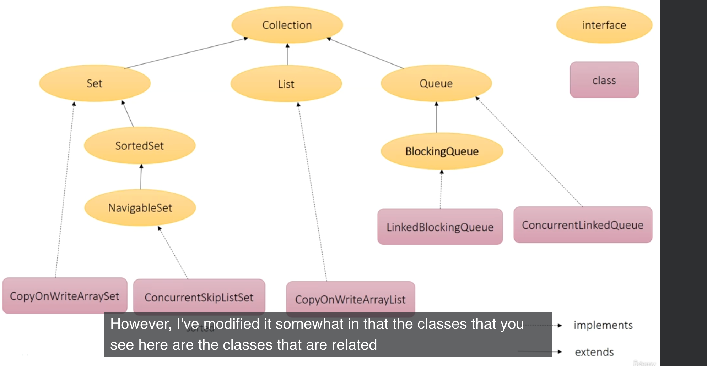
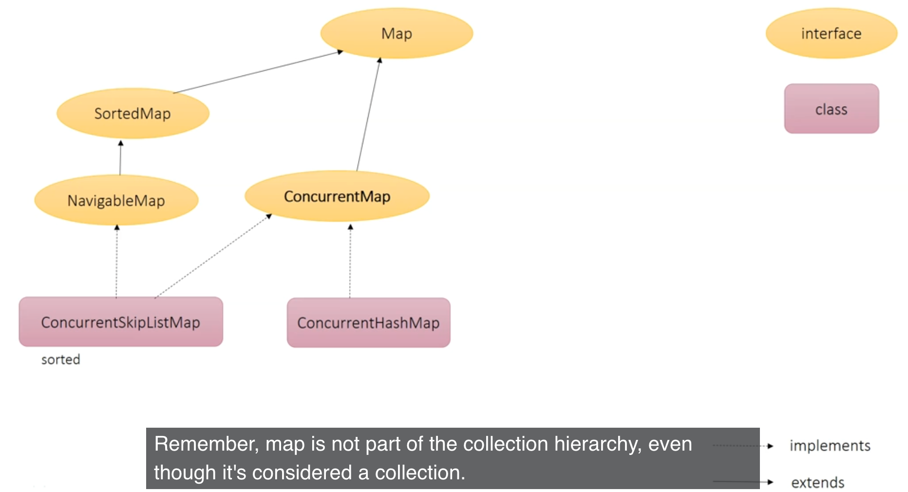
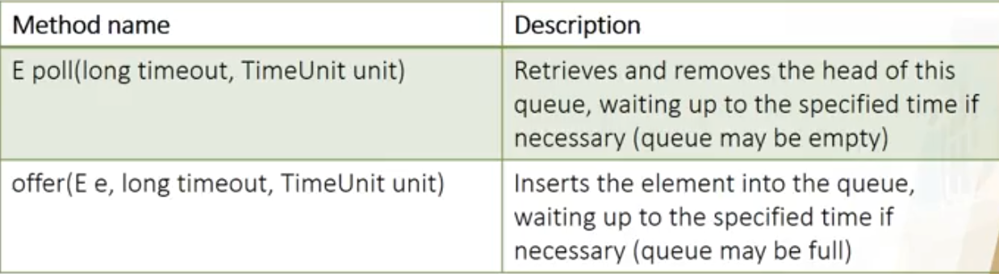

#About concurrent collection
https://funix.udemy.com/course/ocp11_from_oca8/learn/lecture/30186438#questions



## Map


1. SkipList Collections
    * **ConcurrentSkipListSet** 
    * **ConcurrentSkipListMap**
* *Sort by natural order*
* *ConcurrentSkipListSet <=> TreeSet*
* *ConcurrentSkipListMap <=> TreeMap*
*** 
2. CopyOnWrite Collections: *Read a lot, write a very little*
   * **CopyOnWriteArrayList**
   * **CopyOnWriteArraySet**
* *Keep write a little for performance*
*** 
3. Blocking queue: *poll() vs peek()*
   * **ConcurrentLinkedQueue**
   * **LinkedBlockingQueue**
   * **PriorityBlockingQueue** 

***
4. FolkJoinPool
   * ForkJoinTask<V>: một abstract class định nghĩa task sẽ được thực thi trong một ForkJoinPool.
   * ForkJoinPool: là một thread pool quản lý việc thực thi các ForkJoinTasks.
   * RecursiveAction: là một lớp con của ForkJoinTask, nó thực thi tác vụ mà không trả lại bất kỳ kết quả nào (action).
   * RecursiveTask<V>: là một lớp con của ForkJoinTask, nó thực thi tác vụ mà có trả lại kết quả (task).
   * **```ForkJoinPool forkJoinPool = new ForkJoinPool(numOfProcessor);```**
        Tạo một ForkJoinPool với tham số là số lượng luồng hoặc các CPU bạn muốn làm việc đồng thời trên các nhiệm vụ được truyền vào ForkJoinPool. Nếu bạn không xác định numOfProcessor, nó sẽ lấy số bộ vi xử lý có sẵn cho máy ảo Java để thực thi.
***
1. D,F
2. A,C,D,F
3. B,C
4. C
5. D
6. B
7. A
8. G
9. A,C,E
10. C
11. A,F
12. E
13. A,G
14. E
15. C,E,G
16. F,H
17. B
18. F
19. A,F
20. A,D
21. A,C,D,E
22. F
