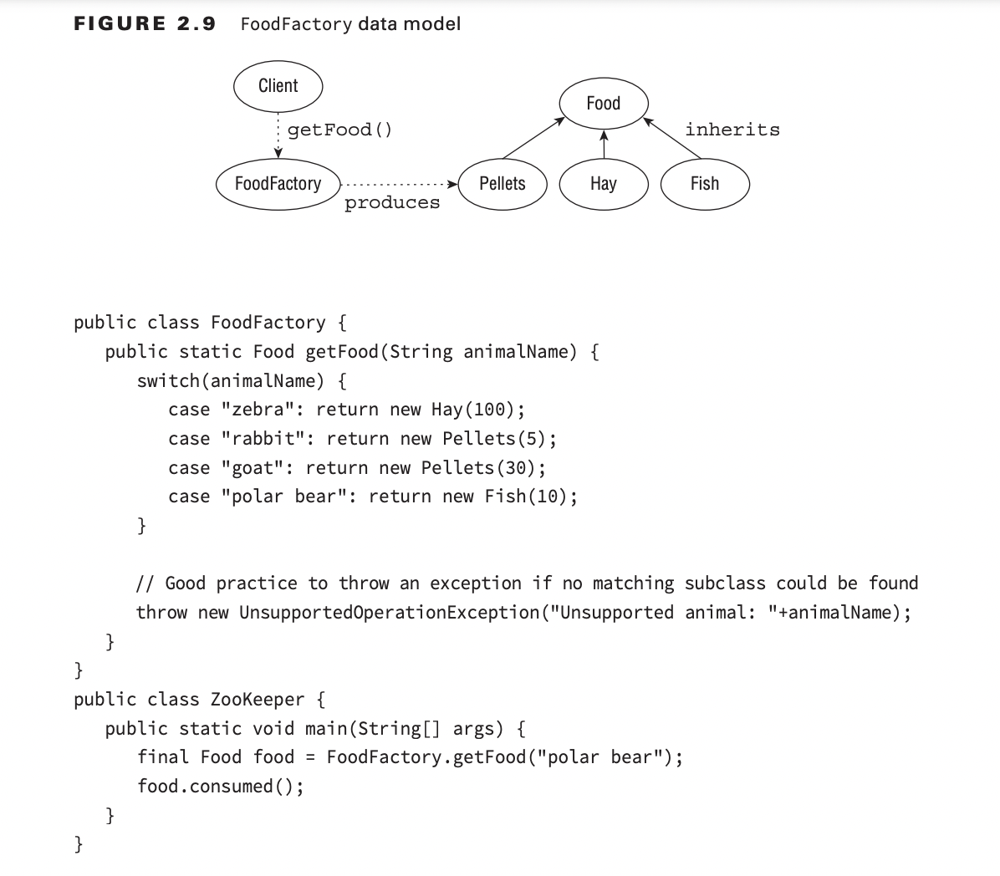

1. The type of the object determines which properties exist within the object in memory.
2. The type of the reference to the object determines which methods and variables are
   accessible to the Java program.
***
###Design pattern
1. Singleton
   * No public constructor
   * static method to create instance
   * final field (param of static method) type of class singleton
2. Immutable
   * Use constructor to set all properties
   * All field mark private final
   * No setter method
   * No reference object allow direct access to modify access directly
   * Prevent method from overridden
3. Builder
   * Tightly couple mode
   * Often create by: static builder class in target class 
4. Factory

***
## Review Question ##
1. E -> C,E
2. B -> E
3. A,C,D -> A,D
4. A,D
5. B,E,F
6. A
7. C,E,G,H
8. C,D,F -> C,F
9. A -> D,F
10. D
11. A,F
12. C
13. B,C,E
14. A,B,D,E
15. C -> B,C
16. C -> F
17. B,C,F
18. B -> A,B,E
19. B,C,E -> B,D,E
20. A 
