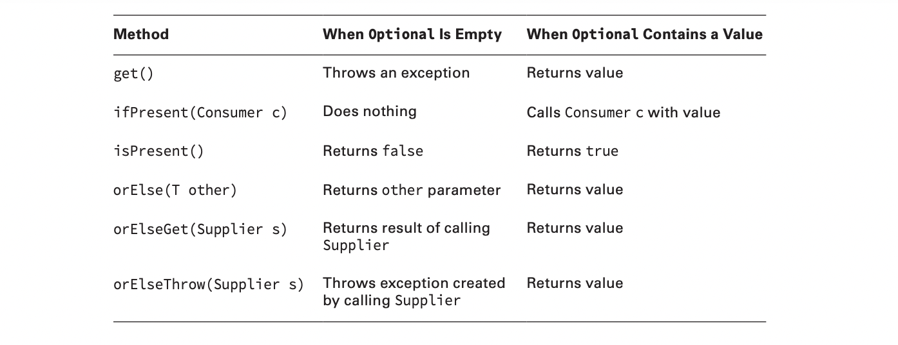
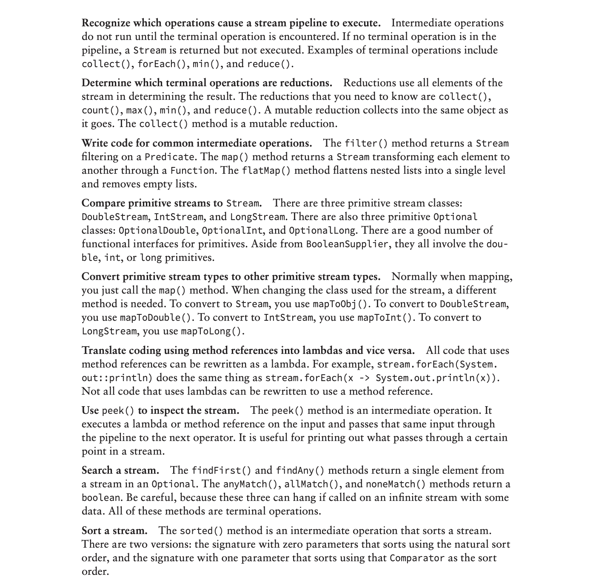

1. Generics and Collections
2. Lambda built-in Functional Interfaces
3. Java Stream API
***

***
1. Predicate: 1 param -> boolean
2. BiPredicate : 2 parameter -> boolean
3. Function : apply
4. TriFunction: apply
5. UnaryOperator : apply
6. Supplier: 0 param return T
7. Consumer:  1 param return void
8. Optional  

***
Creating an Optional uses Optional.empty() or
Optional.of(). Retrieval frequently uses ifPresent() and get(). Alternatively, there are
the functional ifPresent() and orElseGet() methods. 

