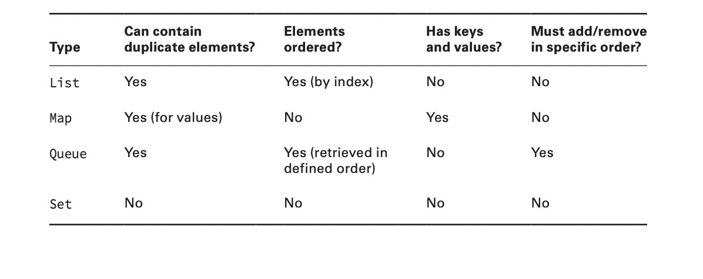
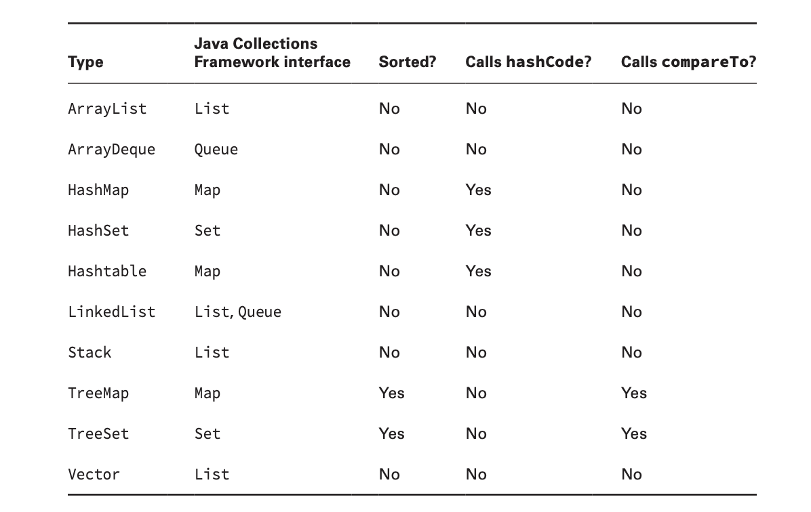
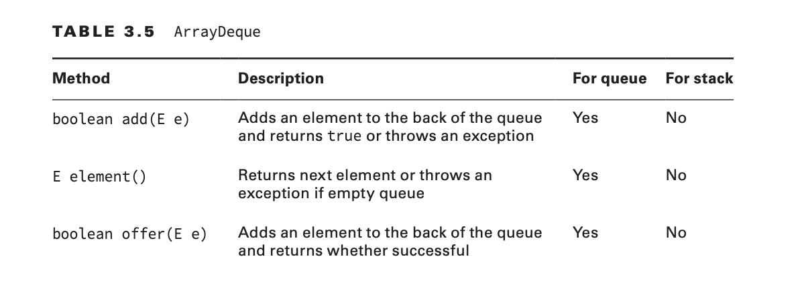
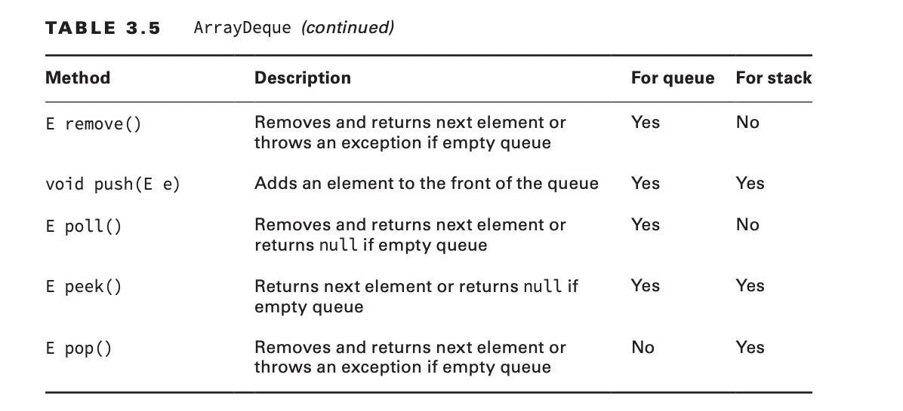
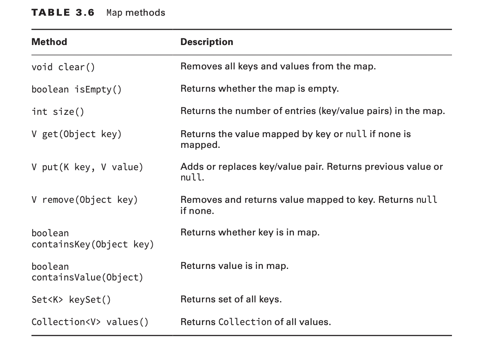
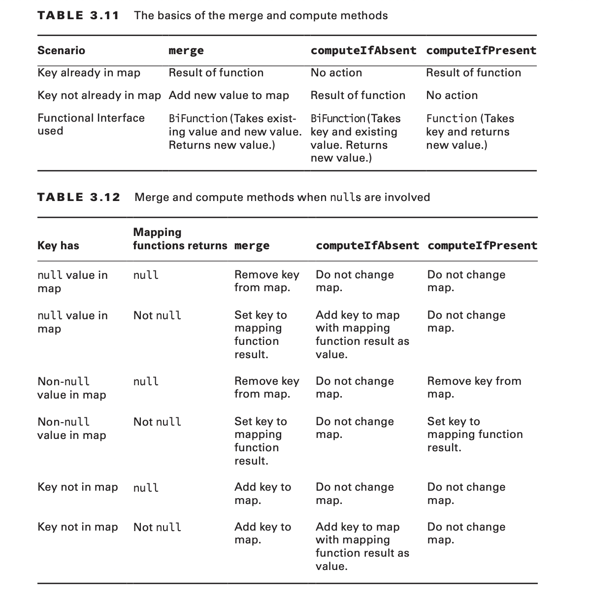

✓ Generics and Collections  
1. Create and use a generic class
2. Create and use ArrayList, TreeSet, TreeMap and ArrayDeque
objects 
3. Use java.util.Comparator and java.lang.Comparable interfaces
4. Iterate using forEach methods on Streams and List
5. Use method references with Streams  
6. Advanced Java Class Design
7. Create and use lambda expressions
8. Generics and Collections
9. Filter a collection using lambda expressions
10. Java Stream API  
 *Use of merge()and flatMap()methods of the Stream API*

***
1. ####Upper bound, lower bound wild card  
   * Upper bound: ? extends A (A, object SUB-CLASS A)  
   * Lower bound: ? super A (A, object SUPER-CLASS A)  
2. ####Java collection framework

-> TreeSet | TreeMap not allow null.
***
    * List: ordered collection of elements that allows duplicate entries.  
        Elements in a list can be accessed by an int index.
    * Set: A set is a collection that does not allow duplicate entries.
    * Queue: A queue is a collection that orders its elements in a specific order for processing.
        A typical queue processes its elements in a first-in, first-out order, but other orderings
        are possible
    * Map: A map is a collection that maps keys to values, with no duplicate keys allowed.
        The elements in a map are key/value pairs.  
***
### Common method Collection
1. add()
2. remove()
3. isEmpty(), size()
4. clear()
5. contains()
#### ArrayDeque
#### PUSH IS NOT IN QUEUE COMMON.

***
#### MAP METHOD

### Comparator VS Comparable
1. Comparator: compare()
2. Comparable: compareTo() 
3. Note key to compare must not be null. If null -> Exception 

***
### Update map method in java 8

### REVIEW
1. B
2. C -> D
3. C -> E
4. F -> E
5. B,C,F
6. B -> C
7. B -> A,D
8. E -> C
9. E
10. E -> A
11. B -> A
12. A,B -> A,B,D
13. B,C,E -> B,E
14. E -> C
15. D
16. B,D,F
17. B,C,D,F -> B,D
18. A,B,C -> A,B
19. A -> A,D
20. E
21. A,F
22. F -> B
23. B,E
24. B,C,F -> F
25. G -> F