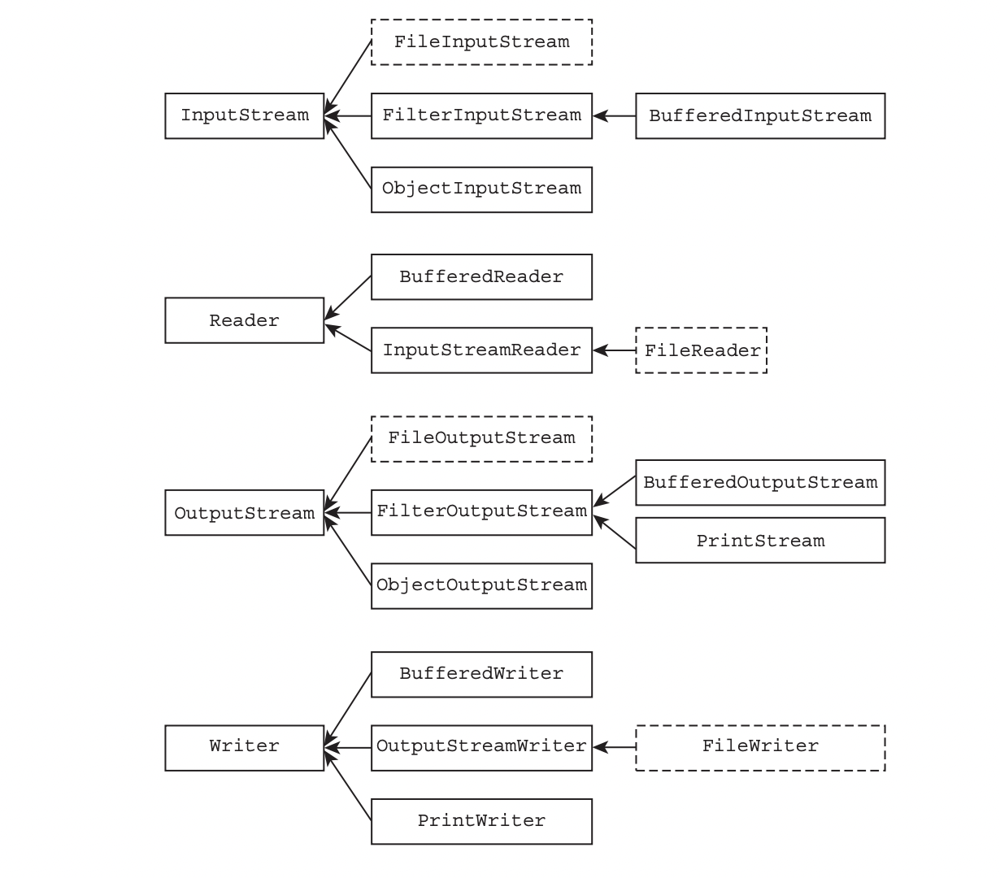

##Note

1. ###File
2. ###Stream
3. ###Serialize
4. ###Console
***
Review Question
1. A -> **A,D**
2. B,E -> **B,E,F**
3. C,D
4. C
5. B -> **B,D,E**
6. A,B -> **A,E**
7. D
8. A,B -> **A**
9. A
10. B -> **C,F**
11. A,B,E,F,G -> **C,E,G**
12. D -> **B,C**
13. A,C,E
14. E
15. D -> **A**
16. D,F
17. A,B,G -> **A,B,D,G**
18. E -> **B,D,E**
19. B,C,D
20. B,E -> **A,C**
21. A,C
22. E
23. H