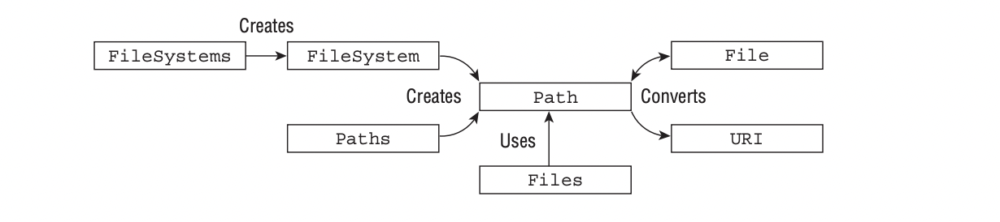
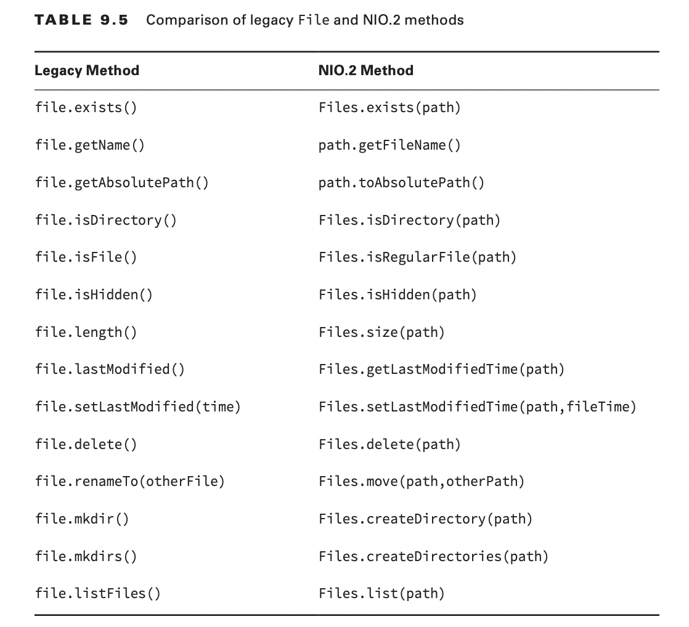

# #NIO2

1. **Path = Paths.get()**;
***

***
#Review questions
1. F
2. A,B,C,D -> **B,C**
3. A -> **D**
4. C
5. Not answer
6. Not answer
7. Not answer
8. Not answer
9. A,B,C
10. Not answer
11. Not answer
12. A,F,G
13. A
14. E
15. A,C,E,F
16. F
17. G
18. Not answer
19. A,C,E
20. A